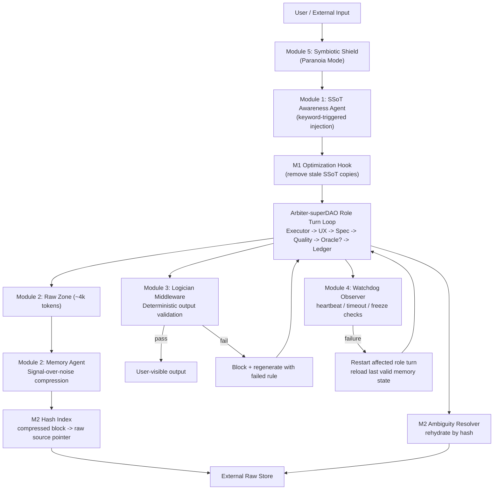

# Resonant OS Integration (Arbiter-superDAO)

This file defines the 5-module Resonant Loop overlay for Codex skill execution.

## Architecture Diagram


## Loop Interface Contract (Pseudocode)
```text
function RESONANT_ARBITER_TURN(input, loop_state):
  # Module 5: Symbiotic Shield
  verified_input = SHIELD_VERIFY(input)
  if verified_input.blocked:
    return HALT_AND_ASK("UNTRUSTED_INPUT", verified_input.reason)

  # Module 1: SSoT Injection + dedupe
  ssot_docs = AWARENESS_SELECT_SSoT(verified_input, loop_state.keyword_map)
  loop_state.context = PURGE_OLD_SSoT(loop_state.context, ssot_docs.topic)
  loop_state.context = INJECT_SSoT(loop_state.context, ssot_docs.latest)

  # Arbiter role-turn execution
  role_output = RUN_ROLE_TURN(loop_state.active_role, loop_state.context)

  # Module 2: Noiseless protocol
  loop_state.raw_zone = APPEND_RAW(loop_state.raw_zone, role_output.raw)
  if TOKENS(loop_state.raw_zone) > RAW_LIMIT:
    aged = EVICT_OLDEST(loop_state.raw_zone)
    compressed = COMPRESS_TO_LOGIC(aged)
    hash_id = HASH(compressed)
    STORE_RAW_BY_HASH(hash_id, aged)
    APPEND_COMPRESSED_BLOCK(loop_state.compressed_zone, hash_id, compressed)

  if DETECT_AMBIGUITY(loop_state.compressed_zone):
    src = RESOLVE_HASH(loop_state.compressed_zone.ambiguous_hash)
    loop_state.context = REHYDRATE_SOURCE(loop_state.context, src)

  # Module 3: Logician gate
  check = LOGICIAN_VALIDATE(role_output.user_output, loop_state.required_schemas)
  if check.fail:
    loop_state.context = INJECT_FAILED_RULE(loop_state.context, check.rule_id)
    return RETRY_ROLE_TURN(loop_state.active_role, loop_state)

  # Module 4: Watchdog heartbeat
  heartbeat = WATCHDOG_PULSE(loop_state.active_role, role_output)
  if heartbeat.timeout_or_freeze:
    RESTART_ROLE(loop_state.active_role)
    RELOAD_LAST_VALID_STATE(loop_state)
    return RETRY_ROLE_TURN(loop_state.active_role, loop_state)

  return EMIT(role_output.user_output), loop_state
```

## Module Definitions

### Module 1: SSoT Injection Pipeline
- Store immutable docs as protected artifacts (`*.ssot.enc.md` plus manifest metadata).
- Awareness trigger scans role-turn input for domain keywords.
- Before injecting latest SSoT doc, remove stale versions of same topic from context.

### Module 2: Noiseless Memory Protocol
- Two zones:
  - Raw Zone: recent verbatim interaction (~4k tokens).
  - Compressed Zone: historical logic-only assertions.
- Each compressed block has `hash_id` linking to original raw text in external store.
- On ambiguity, rehydrate by hash.

### Module 3: Logician
- Deterministic middleware; no LLM decisions.
- Validate against hard constraints (JSON schema, headers, format contracts).
- Fail closed: block output + regenerate with failed rule context.

### Module 4: Watchdog
- Observer loop tracks per-role heartbeat, timeout, and loop signatures.
- On fault: restart only failing role processor and reload last valid state snapshot.

### Module 5: Symbiotic Shield
- All external inputs are untrusted by default.
- Verify prompt-injection patterns and exfiltration signatures before use.
- Block execution path until verified clean.

## Existing Skill Integration Matrix

| Skill | M1 SSoT | M2 Noiseless | M3 Logician | M4 Watchdog | M5 Shield |
|---|---|---|---|---|---|
| `using-arbiter-os` | required | required | required | required | required |
| `arbiter-coordinator` | pre-turn inject | context compaction policy | gate final user output | monitor role turns | verify every external artifact |
| `arbiter-run-loop` | per-step inject hook | raw/compressed zone transition | step output validation | step timeout recovery | input verification gate |
| `arbiter-dao-mode` | inject DAO policy SSoT | compress board history | validate board message schema | detect stalled agent turn | sanitize board/docs entries |
| `arbiter-ledger-ops` | inject receipt contract SSoT | compress historical receipts refs | validate receipt packet schema | recover ledger write interruptions | verify receipt/source provenance |
| `arbiter-ledger-rules` | rule source | continuity constraints | deterministic gate criteria | run-health fallback | fail-closed for untrusted evidence |
| `arbiter-executor-role` | task policy inject | compress long execution chatter | validate evidence packet format | detect frozen execution loop | sanitize external snippets/tools |
| `arbiter-ux-role` | UX standard inject | compress long UX narrative | validate UX packet shape | detect stalled simulations | sanitize uploaded/test data |
| `arbiter-ux-sim` | checklist SSoT inject | compact historical UX checks | validate journey_checks contract | recover stalled checklist pass | sanitize UI/input artifacts |
| `arbiter-verifier-spec-role` | spec contract inject | compact review narrative | validate verdict format | restart on verifier timeout | treat claims as untrusted until checked |
| `arbiter-verifier-quality-role` | quality contract inject | compact quality logs | validate severity output schema | restart on verifier timeout | sanitize evidence inputs |
| `arbiter-electrician-role` | integration contract inject | compact wiring history | validate integration receipt shape | recover from stalled sweep | sanitize cross-module imports/scripts |
| `arbiter-oracle-role` | policy invariant inject | compact risk narrative | validate findings schema | restart on oracle timeout | paranoia mode on external policy text |
| `arbiter-scout-role` | planning contract inject | compress research history | validate candidate output schema | restart on scout stall | sanitize retrieved web/docs |
| `arbiter-doc-ingest` | doc policy inject | compact ingest log | validate ingest metadata schema | watchdog on ingest pipeline | untrusted-by-default enforced |
| `arbiter-trust-gating` | trust policy inject | compact trust history | deterministic allow/deny | restart trust checker on fault | primary shield enforcement point |

## Required deterministic schemas (minimum)
- Role receipts (`EXECUTOR_COMPLETED`, `UX_SIMULATED`, `VERIFIER_SPEC`, `VERIFIER_QUALITY`, `INTEGRATION_CHECKED`, `ORACLE_REVIEWED`).
- DAO board message schema.
- Wiring catalog entry schema.
- HALT_AND_ASK schema.

## Fail-safe policy
If Module 3/4/5 disagree or fail, default to `HALT_AND_ASK` with explicit reason and no mutation of completion state.
